# 1. Keyword and Stock Price Analysis


## Motivation
Our hypothesis is that there should be some correlation between keyword search frequency and stock price.
For example, there could be a breaking news about a company (which often result in large volume of keyword search for that company)
and this would likely attract investors' attention. On the other hand, there could an abrupt change in stock price of a company and 
this could make the investors to search for the company in order to investigate on the ongoing situation.
However, it is also possible that the correlation might not be statistically significant.

Therefore, we would like to investigate on the correlation between search frequency and stock price, 
and will try to find out the correlation between them. And if correlation exists, we will try to find out how these two factors
influence each other. For example, it could be possible that the sudden changes in keyword search frequency 
occurs first and consecutively trigger changes in prices or vice versa.

## Objectives
1. Find correlation between keyword search frequency and stock price (or volume)
    - Are there significant (long-term/short-term) correlation?
2. Compare KOSPI and KOSDAQ companies
    - To find out what kinds of companies are more sensitive to issues.
3. Compare different sector companies
    - To find out what kinds of companies are more sensitive to issues.

## Background
### Data
1. Stock Price (Daily)
   - We used stock price data crawled from Naver Finance webpage

2. Keyword Search Frequency (Daily)
   - We used keyword search frequency data provided by Naver Datalab API.

#### Metrics used for calculating correlation
a. Pearson Correlation
  - Point-to-point comparison
  - Would not effectively capture correlation if there is some delay(time-shift) between two dataset

b. Normalized Cross Correlation
  - Normalized scales 
  - Captures time-shift
  
c. Normalized Cross Correlation with percentage changes
  - Instead of absolute values of dataset, we converted all data points to percentage changes w.r.t. previous data point 
 
## Methods
### 1. Long term Correlation (Full-Comparison Analysis)

In this experiment, we would like to see if there is any significant long term correlation between keyword and price.
Long term correlation could mean that there is general similarity in the moving pattern of keyword and price.
Our approach is to compare keyword and price dataset over a period of 4 years (2016 - 2019).
  
#### Results
  1. Keyword vs Price
      
      a. Pearson Correlation
      
      | KOSPI | KOSDAQ | 
      | ----- | ------ |
      | 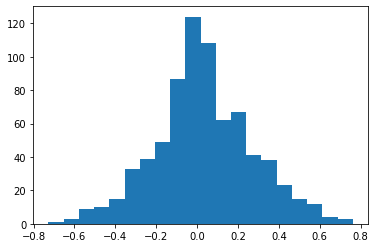 | 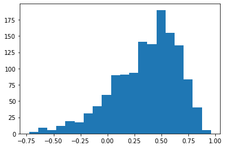  |

      b. Normalized Cross Correlation
      
      | KOSPI | KOSDAQ | 
      | ----- | ------ |
      | 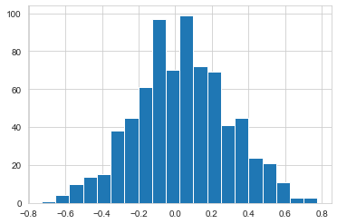 | 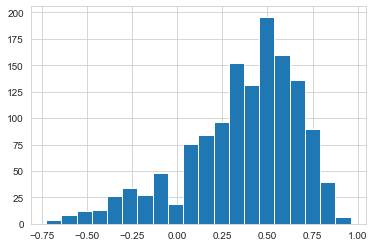  |
      
      c. Normalized Cross Correlation (Percentage changes)
      
      | KOSPI | KOSDAQ | 
      | ----- | ------ |
      | 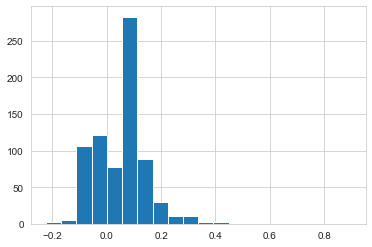 | 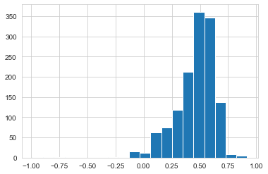  |
  
  2. Keyword vs Volume
  
      a. Pearson Correlation
      
      | KOSPI | KOSDAQ | 
      | ----- | ------ |
      | 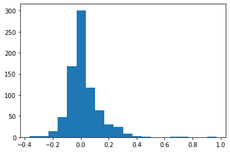 |   |

      b. Normalized Cross Correlation
      
      | KOSPI | KOSDAQ | 
      | ----- | ------ |
      | 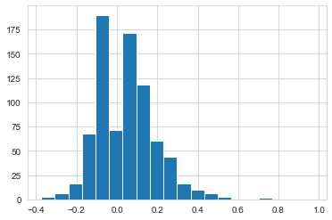 | 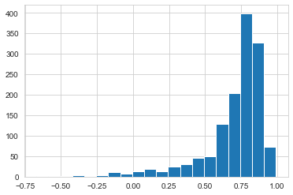  |
      
      c. Normalized Cross Correlation (Percentage changes)
      
      | KOSPI | KOSDAQ | 
      | ----- | ------ |
      | 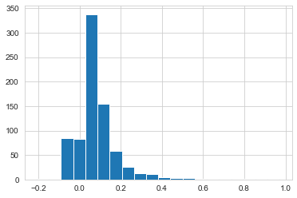 |   |
  

### 2. Short term Correlation (Peak-centered Analysis)

From the first experiment, we found there could be long-term correlation for KOSDAQ companies.
However, we perceived that influence between these two variables would be more significant in the short-term.
From observation of many companies' graphs, we could find that there might not be much correlation in normal situations,
but two variables seemed to move together near the peaks.

Based on this observation, we proposed another approach, which is to compare the keyword and price within a short time interval 
(in this case, two weeks) near the peaks.

```
# Peak-centered analysis

1. Find 20 peaks in the keyword dataset 
2. Extract time intervals (2 weeks) using peak datetime as the center
3. Calculate normalized cross correlation between keyword and time in each time interval
```


#### Results

  1. Keyword vs Price

      a. Normalized Cross Correlation
      
      | KOSPI | KOSDAQ | 
      | ----- | ------ |
      | 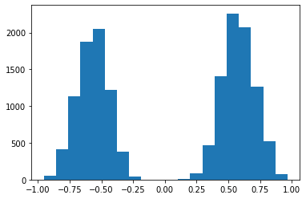 | 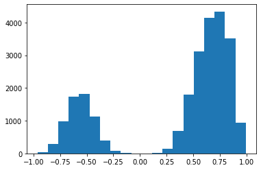  |
      
      b. Looking deeper into top company with highest average correlation
      
      | KOSPI (Company Code 090080) | KOSDAQ (Company Code 025870) | 
      | ----- | ------ |
      | 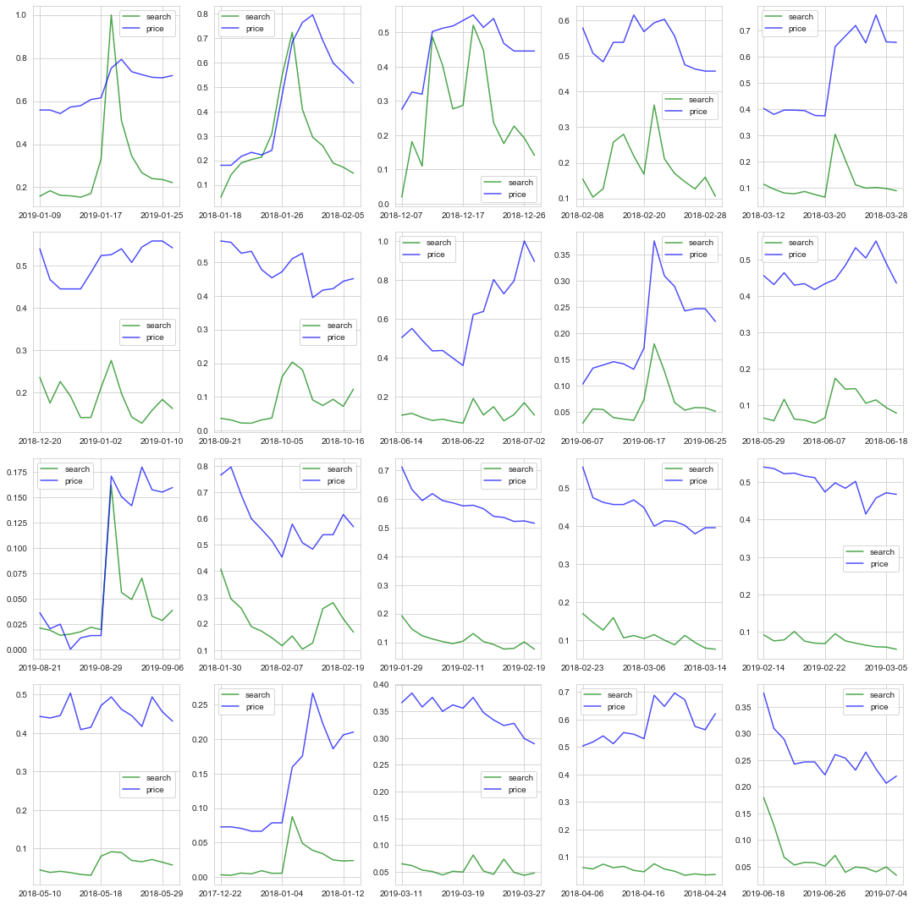 | 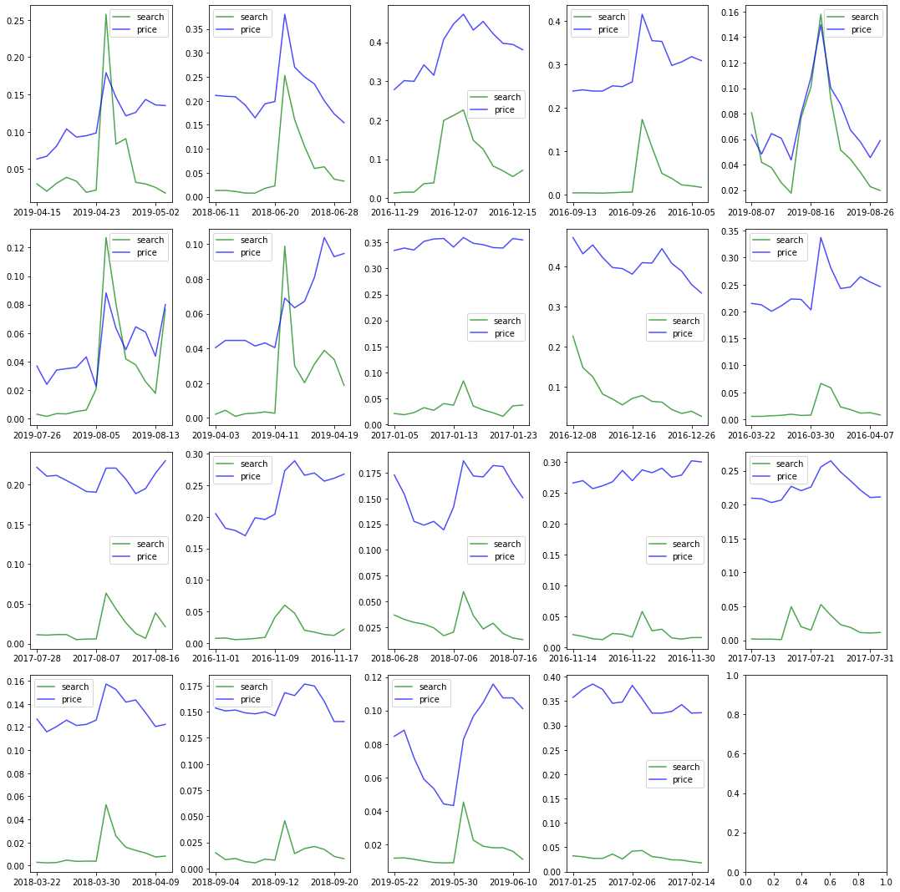  |

  2. Keyword vs Volume
  
     Similar results as above
  
  3. Comparing Sectors
  
  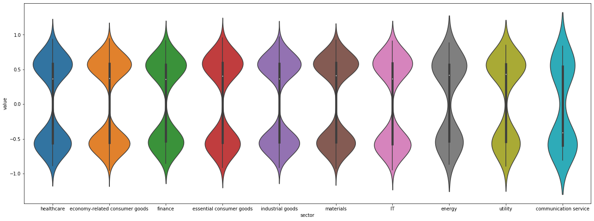

#### Observation
Surprisingly, the results showed that the mean correlation values of these time intervals were around 0.5, 
which could be considered a statistically-significant correlation between the two variables.
It has both positive and negative values because keyword indicate both positive and negative issues.

In fact, the distribution looked analogous to a normal distribution, which means that if it could be approximated
using a normal distribution, then majority (68%) would be inside 1 SD of mean value (0.35 ~ 0.65). 
This is a strong evidence backed by statistical values that there exists short-term correlation between keyword
and prices near the peaks.


## Limitations
1. Only daily-wise data available
    - Unfortunately, the data for keyword is only available daily-wise, so we could not investigate on the minute-wise
    relationship. We believe that there could be more findings (e.g. how long does it take to influence one another) 
    if we have more detailed data.

## Future Works
Our current work provide some evidence that there are some correlation between two variables.
However, this information might not be significant enough to be incorporated in real trading strategy.
We would like to deep further into other factors (such as news, stock reports) that could be connected to keyword and price so that it can actually act as a signal for a price change.


## Extras
### - Files Structure
```
[analysis]
- files for analysis and experiments

[data]
- data files used for analysis
- divided into company types: kospi/kosdaq
- divided into data types: price/keyword/combined

[dataprocess]
- files for data processing (crawler, data cleaning)
```
